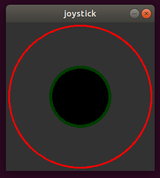
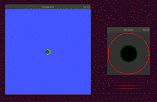

# ros_joystick

## Introduction
This ROS package contains a node that will publish planar twist messages (x and y velocities components) based on user input through joystick GUI. 

<p align="center">
  
</p>
<p align="center">
    Fig: joystick GUI
</p>

## Dependencies
This package was developed in **ROS melodic** on **Ubuntu 18.04 LTS**
- Python
- OpenCV python library

## Downloading and Running the Code
- Clone the RRT repository to your local ROS workspace.
    ```
    git clone https://github.com/arthurgomes4/ros_joystick.git
    ```
- After building and sourcing workspace:
    ```
    rosrun ros_joystick joystick.py
    ```

- Press Esc to exit program

<p align="center">
  
</p>
<p align="center">
    Fig: Using the GUI
</p>

## Changing Parameters
Certain parameters can be adjusted from the python script ```joystick.py```.

All changeable parameters are listed from lines 9 to 32.
```
# --------- PARAMS --------------
# OUTPUT TOPIC 
vel_topic = '/turtle1/cmd_vel'

# MAX VALUE on each axes
max_speed = 5

# length of the joystick window in pixels
frame_size = 251

# set the centre of the joystick window
frame_centre = (125,125)

# set the colour of the joystick window (BGR)
frame_colour = (50,50,50)

# The control circle is the red outer circle 
# beyond which the mouse cursor will not hold the stick 
control_circle_radius = 120
control_circle_colour = (0,0,255)

# size of the joystck itself
stick_radius = 50

# --------------------------------
```
[](https://code.visualstudio.com/)
[](https://github.com/arthurgomes4)
